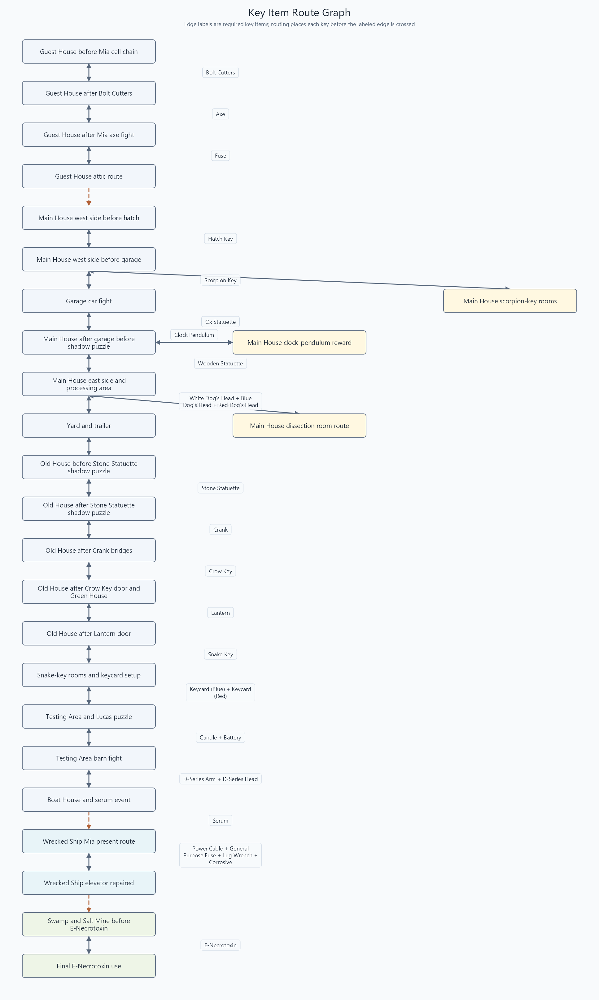

# BioRand 7

[](https://github.com/juliangrtz/re7/actions/workflows/ci.yml) [](https://github.com/juliangrtz/re7/issues) 


<p align="center">
    
</p>
<br>

BioRand 7 is a [cloud randomizer](https://beta-re7.biorand.net/) and mod-generation toolkit for [Resident Evil 7 Biohazard](https://store.steampowered.com/app/418370/Resident_Evil_7_Biohazard/) based on the [BioRand infrastructure](https://github.com/biorand).

This repository contains the .NET randomizer library, command-line tools, data-generation utilities, tests, REFramework plugin code, and reverse-engineering notes that support it.

BioRand 7 is a fan-made project and is not affiliated with or endorsed by Capcom. You need a legally owned copy of Resident Evil 7 including all DLCs to use game-derived inputs locally.

## Status

BioRand 7 is in active beta development. Item, weapon, inventory, recipe, and several progression-safety systems are already implemented; enemy and chapter-related work is still especially sensitive and should be tested carefully.

For current design notes and planned work, see:

- [Roadmap](docs/Roadmap.MD)
- [Technical notes](docs/Notes.MD)
- [Enemy spawning notes](docs/enemies/enemy_spawning.md)
- [Key item route graph](docs/key_item_route_graph.png)
- [Flags, triggers, stats notes](docs/UvarVariables.MD)

## Features

<a href="docs/key_item_route_graph.png">
    
</a>

- Generates RE7 randomizer output as a patch PAK, Fluffy Mod Manager ZIP, or extracted `natives/` folder.
- Supports seeded generation and JSON configuration profiles.
- Randomizes items, key item locations, item drops, bird cages, starting inventory, inventory stack limits, and crafting recipes.
- Includes weapon stat randomization for damage, ammo capacity, and reload speed.
- Includes enemy randomization options for enemy classes, multipliers, placement, health, speed, damage, and scale.
- Adds REFramework artifacts when features require runtime support.
- Provides standalone mod export commands for bundled optional mods.
- Uses embedded, spreadsheet-derived, and generated data so behavior can be tested without a local RE7 install.

## Requirements

- [.NET 10 SDK](https://dotnet.microsoft.com/)
- Git with [Git LFS](https://git-lfs.com/)
- A local Resident Evil 7 install with all DLCs for local setup/mod generation workflows
- Windows is recommended for game-related workflows

Large embedded assets, including `src/Biohazard.BioRand.RE7/_Data/silver_birthday_patches.zip`, are stored with Git LFS. Install Git LFS before cloning when possible:

```powershell
git lfs install
```

For an existing clone, fetch the LFS payloads before building or running tests:

```powershell
git lfs pull
```

## Build And Test

From the repository root:

```powershell
dotnet restore .\biorand-re7.sln
dotnet build .\biorand-re7.sln --no-restore
dotnet test .\biorand-re7.sln --no-build --verbosity normal
```

## Benchmarks

Randomizer throughput benchmarks live in `src/Biohazard.BioRand.RE7.Benchmarks/` and use the embedded baseline PAK, `%USERPROFILE%\.biorand\biorand-re7.pak`, or a path supplied through `BIORAND_RE7_BENCHMARK_PAK`.

Run them from the repository root in Release mode:

```powershell
dotnet run -c Release --project .\src\Biohazard.BioRand.RE7.Benchmarks\Biohazard.BioRand.RE7.Benchmarks.csproj
```

To run a single scenario:

```powershell
dotnet run -c Release --project .\src\Biohazard.BioRand.RE7.Benchmarks\Biohazard.BioRand.RE7.Benchmarks.csproj -- --filter *DefaultProfile*
```

The `RealisticProfile` scenario uses the checked-in profile under `src/Biohazard.BioRand.RE7.Benchmarks/Profiles/`. Benchmarks disable dynamic Google Sheets downloads by default; set `BIORAND_RE7_BENCHMARK_DOWNLOAD_DATA=1` to include that external fetch cost.

## Data Workflows

Some runtime data is embedded under `src/Biohazard.BioRand.RE7/_Data/`. Changes there affect generated seeds, not only tests.

Refresh dynamic CSV data from the [Google Sheets spreadsheets](https://docs.google.com/spreadsheets/d/1YNdX9LWrhh6KDKd8Mx7JpTCMq8XY8u6BfX20YYNx9jk):

```powershell
dotnet run --project .\src\biorand-re7\biorand-re7.csproj -- update
```

Run data generators:

```powershell
dotnet run --project .\src\Biohazard.BioRand.RE7.DataGen\Biohazard.BioRand.RE7.DataGen.csproj -- generate config
dotnet run --project .\src\Biohazard.BioRand.RE7.DataGen\Biohazard.BioRand.RE7.DataGen.csproj -- generate areas item_placements item_definitions weapon_definitions enemies
dotnet run --project .\src\Biohazard.BioRand.RE7.DataGen\Biohazard.BioRand.RE7.DataGen.csproj -- generate area_scene_targets -f Json
dotnet run --project .\src\Biohazard.BioRand.RE7.DataGen\Biohazard.BioRand.RE7.DataGen.csproj -- rsz-to-cs app.TypeName --with-enums
```

Generated files are written to `GeneratedFiles/`. Some generators also copy outputs into `_Data/`.
The key item route graph image is refreshed into `docs/key_item_route_graph.png` when the DataGen project builds.

## Repository Layout

```text
src/Biohazard.BioRand.RE7/                    Core randomizer library
src/biorand-re7/                              Command-line app
src/Biohazard.BioRand.RE7.Benchmarks/         BenchmarkDotNet throughput benchmarks
src/Biohazard.BioRand.RE7.DataGen/            Data and code generators
src/Biohazard.BioRand.RE7.REFrameworkPlugins/ REFramework.NET plugin
src/Biohazard.BioRand.RE7.Tests/              xUnit regression tests
docs/                                         Notes, roadmap, and research docs
assets/                                       Project assets and bundled mod assets
```

## Contributing

Contributions are welcome, especially focused bug fixes, tests, documentation, data corrections, and carefully scoped randomizer improvements.

Start with [CONTRIBUTING.md](CONTRIBUTING.md). For issues, use the existing GitHub templates and attach the randomizer ZIP output when reporting crashes or softlocks. Do not attach full vanilla game PAKs, game install dumps, local credentials, or private files.

## Acknowledgements

BioRand 7 would not be possible without a few amazing people and tools:

- [IntelOrca](https://github.com/IntelOrca)'s [BioRand infrastructure](https://github.com/biorand)
- [Battlezone](https://github.com/seifhassine)'s [REasy](https://github.com/seifhassine/REasy)
- [kagenocookie](https://github.com/kagenocookie)'s [REE Content Editor](https://github.com/kagenocookie/REE-Content-Editor)
- [praydog](https://github.com/praydog)'s [RE Framework](https://github.com/praydog/REFramework)
- [alphaZomega](https://github.com/alphazolam)'s many contributions to RE modding

## License

This project is licensed under the [MIT License](LICENSE).
